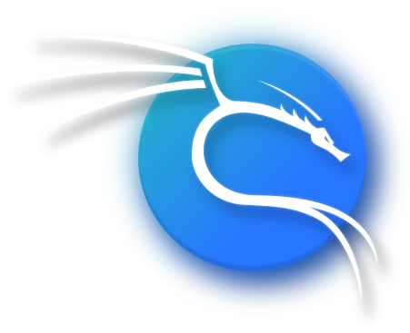

  

    
  

  
  
  

---

  

---

 

  
  

    
<b>Back-End Developer & Offensive Security Student</b>

    Estudante de Análise e Desenvolvimento de Sistemas (UNIP), focado no desenvolvimento de APIs de alta performance com <b>Go (Golang) e Node.js</b>, arquitetura de microsserviços, <b>Docker</b> e bancos de dados relacionais.
      
    Paralelamente, me dedico aos estudos práticos de <b>Cibersegurança (Red & Purple Team)</b>, auditoria de código, análise de vulnerabilidades e testes de intrusão, utilizando o ecossistema Linux/Kali/BlackArch para entender como sistemas falham e como torná-los imutáveis a ataques.
      
  

 

 

  <h3>Technologies & Security Arsenal</h3>

---

 

  <h3>Statistics</h3>

---

 

  

 

  

